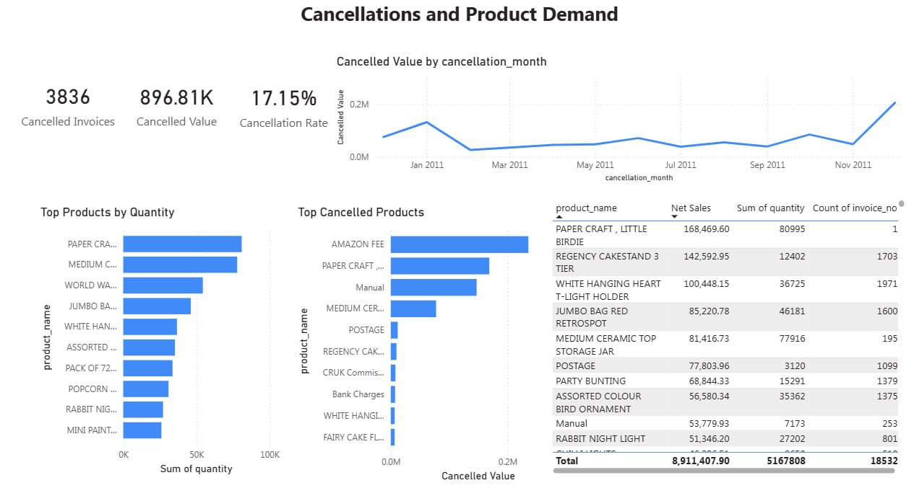

# UK Online Retail: Sales and Customer Retention Dashboard

## Business problem

I built this as if I were reporting to the Sales Manager of a UK online gift retailer. They need to understand how sales are performing, work out which customers are actually worth the most, spot repeat customers who've gone quiet, and get a sense of how much cancellations are costing. The dataset has price and revenue in it but nothing on costs, so this project is about sales and revenue, orders, customers and cancellations — not profit or margin.

## Dataset

The UCI Online Retail dataset: transaction-level data from a UK-based non-store retailer, covering 1 December 2010 to 9 December 2011. 541,909 rows, each one a single product line on an invoice (invoice number, stock code, description, quantity, invoice date, unit price, customer ID, country).

Citation:

> Chen, D. (2015). Online Retail [Dataset]. UCI Machine Learning Repository. https://doi.org/10.24432/C5BW33

Licensed CC BY 4.0.

## Tools

- PostgreSQL
- SQL (views, window functions, CTEs)
- Python (pandas, for the one-off Excel to CSV conversion)
- Power BI Desktop
- Power Query
- DAX

## Repo structure

```
├── data/                      raw Excel file + converted CSV (not tracked in git)
├── sql/                       the five SQL scripts, run in order
├── python/                    Excel → CSV conversion script
├── outputs/query_results/     CSV exports of every analysis query, for checking Power BI against
├── powerbi/                   DAX measures reference
├── images/                    dashboard screenshots (one per page)
├── DATA_QUALITY_FINDINGS.md   actual results of the data quality checks
├── POWERBI_BUILD_GUIDE.md     step-by-step guide for the Power BI build
└── README.md
```

## Data preparation

I did the cleaning as SQL views rather than editing the raw table, so the original data stays untouched and every cleaning decision is visible and reversible. Based on what I actually found running the checks in `sql/02_data_quality_checks.sql` (full write-up in [DATA_QUALITY_FINDINGS.md](DATA_QUALITY_FINDINGS.md)):

- Excluded cancellation invoices, which start with `C` — 3,836 of them, worth £896,812.49. That's about 1 in 6 orders, so cancellations get their own page rather than being netted quietly into the sales figures.
- Excluded rows with non-positive quantity or price (10,624 and 2,521 rows respectively) — these are mostly manual stock adjustments, write-offs and free samples rather than genuine sales.
- Excluded the 135,080 rows (almost 25% of the dataset) with no customer ID — there's no way to attribute these to anyone, so they're dropped from customer-level analysis. This means the customer numbers in this project cover roughly three-quarters of transactions, not all of them, and I've said so rather than pretending otherwise.
- Calculated sales value as `quantity * unit_price`.
- Treated a customer as "at risk" if they've placed at least two orders but haven't ordered in over 90 days, measured against the last transaction date in the dataset (December 2011), not today's date. Comparing against today would mark literally every customer as inactive, since the data is over a decade old.

## Dashboard pages

1. Sales performance overview


2. Customer retention and value


3. Cancellations and product demand



## Key business questions

- How are sales and orders changing over time?
- Which products and countries contribute most to sales?
- Who are the most valuable customers?
- Which high-value customers have gone quiet and need retention effort?
- What's the scale and pattern of cancellations?

## Key insights and recommendations

**Finding:** A small group of high-value repeat customers has gone quiet. 195 customers meet the "high-value" bar (2+ orders, £1,000+ lifetime spend) but haven't ordered in over 90 days, together worth £471,684.33 in historical spend — about 5.3% of total net sales sitting with customers who've stopped buying.
**Evidence:** Customer Retention page, "High-Value At-Risk Customers" KPI and table. Top of that list: customer 15749.0 (£44,534.30 lifetime spend, last order 235 days before the dataset ends) and 15098.0 (£39,916.50, 182 days quiet).
**Business implication:** These aren't casual shoppers — they've already proven they'll place multiple large orders. Losing them permanently is a bigger revenue risk than losing a one-time buyer.
**Recommended action:** The Sales Manager should prioritise this exact list for direct, personalised re-engagement (account manager call, a tailored offer) rather than a generic marketing blast, starting with the highest-spend names at the top of the table.

**Finding:** Sales are heavily seasonal, climbing steadily from a low in February (£447,137.35) to a peak in November (£1,161,817.38) — a 2.6x swing across the year — before the visible December figure drops, which reflects the dataset simply ending on 9 December rather than a genuine sales collapse.
**Evidence:** Sales Overview page, Monthly Net Sales Trend chart and the month-on-month growth figures behind it (November alone grew 11.79% on October).
**Business implication:** This is a UK gift retailer, so the autumn build-up into November is almost certainly pre-Christmas ordering. Stock, staffing and marketing spend should already be weighted toward Q4, and the "December drop" should not be read as a demand problem when reporting on it.
**Recommended action:** Plan inventory and campaign timing around the September–November ramp-up specifically, and caveat any December figures in future reporting as a partial month, not a real decline.

**Finding:** Beyond the UK (which drives £7,308,391.55 of the £8.91M total), the Netherlands, EIRE, Germany and France are the strongest international markets, together generating the bulk of non-UK revenue from a comparatively tiny number of customers — e.g. the Netherlands' £285,446.34 comes from just 9 customers.
**Evidence:** Sales Overview page, Top International Countries chart and Sales by Country table.
**Business implication:** International revenue is currently concentrated in a handful of accounts per country rather than broad-based demand, meaning it's fragile (a couple of lost accounts could visibly dent a country's numbers) but also under-tapped — there's room to grow the customer count in these already-proven markets rather than needing to find new ones from scratch.
**Recommended action:** Focus international growth effort on deepening the Netherlands, EIRE, Germany and France markets (e.g. targeted acquisition in those four) before spending budget testing new, unproven countries.

**Finding:** Cancellations are a genuinely material cost, not a rounding error — 3,836 cancelled invoices worth £896,812.49, a 17.15% cancellation rate (roughly 1 in 6 invoices raised). Cancelled value also spikes sharply in December 2011 (£205,124.67, more than double any other month).
**Evidence:** Cancellations page, KPI cards and Cancelled Value by Month chart.
**Business implication:** Cancellations are too large to ignore in reporting, and the December spike deserves investigation — it could be genuine holiday-period returns, or it could partly be the same "partial month" effect distorting the sales trend. Separately, the single biggest line on the "Top Cancelled Products" chart is "AMAZON FEE" (£235,281.59 across just 32 invoices), which isn't a real product cancellation at all — it's almost certainly a marketplace fee adjustment that happened to get recorded with a cancellation-style invoice number, alongside similar non-product entries ("Manual", "CRUK Commission", "Bank Charges").
**Recommended action:** Investigate the December cancellation spike specifically before assuming it's a seasonal pattern. Separately, flag to whoever maintains this data that fee/administrative adjustments and genuine customer product returns are being recorded under the same invoice convention — splitting them would make this chart trustworthy at face value instead of needing a manual caveat.

**Finding:** One-time customers are the second-largest segment by headcount (1,493 customers, 34.4% of the 4,338 identified customers) but contribute comparatively little revenue (£616,311.73, an average of just £412.80 each) next to the 1,399 "High-value active" customers who average £5,093.19 each.
**Evidence:** Customer Retention page, Customer Count by Segment chart and segment summary.
**Business implication:** A third of the customer base has only ever bought once. Converting even a modest share of these into a second purchase would likely be cheaper than acquiring a brand-new customer, since they're already past the first-purchase hurdle.
**Recommended action:** Test a simple second-purchase incentive (e.g. a follow-up discount or product recommendation) aimed specifically at one-time customers shortly after their first order, and track whether it moves people into the "Active repeat customer" segment.

## Limitations

- No cost or profit data — everything here is about revenue and order volume, not margin.
- No customer names or marketing-channel data, just customer IDs.
- "At risk" is a fixed business rule (2+ orders, £1,000+ spend, 90+ days quiet), not a predictive churn model — it's a reasonable starting point, not the final word. A couple of single-order customers with very high spend fall outside this rule entirely and get classed as "one-time," which is a genuine limitation worth being upfront about (see `DATA_QUALITY_FINDINGS.md` for the specific examples).
- Roughly a quarter of raw rows have no customer ID attached and are excluded from every customer-level figure, so those numbers describe the ~75% of transactions that can be attributed to a customer, not the entire dataset.

## How to reproduce this

1. Download `Online Retail.xlsx` from the [UCI repository](https://archive.ics.uci.edu/dataset/352/online+retail) into `data/` (see `data/README.md`).
2. Convert it to CSV:

```bash
pip install -r requirements.txt
python python/01_excel_to_csv.py
```

3. Create the database and load the raw table:

```bash
createdb online_retail_db
psql -d online_retail_db -f sql/01_create_table.sql
```

4. Run the rest of the SQL in order:

```bash
psql -d online_retail_db -f sql/02_data_quality_checks.sql
psql -d online_retail_db -f sql/03_clean_views.sql
psql -d online_retail_db -f sql/04_sales_analysis.sql
psql -d online_retail_db -f sql/05_customer_analysis.sql
```

`DATA_QUALITY_FINDINGS.md` has the actual output of step 4's quality checks, and `outputs/query_results/` has a CSV export of every analysis query, which is what I checked the Power BI numbers against while building the dashboard.

5. Open Power BI Desktop and follow `POWERBI_BUILD_GUIDE.md` — it's a click-by-click walkthrough covering the PostgreSQL connection, the date table, all eleven DAX measures (also listed on their own in `powerbi/dax_measures.txt`), and how each of the three report pages was built.
