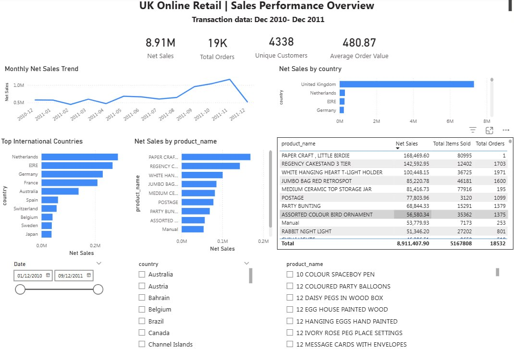
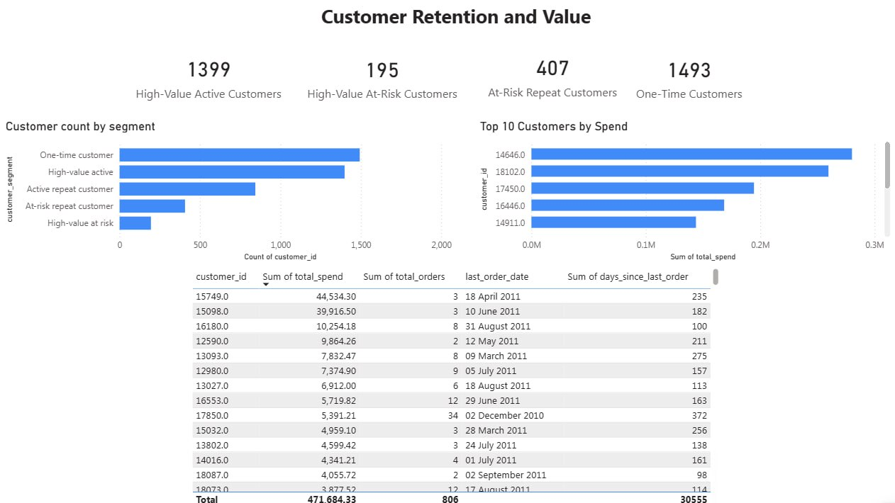

# UK Online Retail: Sales and Customer Retention Dashboard

A three-page Power BI dashboard over 541,909 UK retail transactions, built on PostgreSQL, that finds 195 high-value customers worth £471,684.33 who have gone quiet.

## Key Findings

| Priority | Insight | Headline number | Recommended action |
|---|---|---|---|
| 1 | High-value customers gone quiet | **195** customers, **£471,684.33** at risk | Direct, personalised re-engagement |
| 2 | Cancellations are material | **17.15%** rate, **£896,812.49** | Investigate Dec spike; fix fee mislabeling |
| 3 | A third of customers never came back | **1,493** one-time buyers (34%) | Test a second-purchase incentive |
| 4 | Sales are sharply seasonal | **2.6x** swing, Feb → Nov | Weight stock & marketing to Q4 |
| 5 | International revenue is concentrated | 4 markets = most non-UK sales | Deepen NL/EIRE/DE/FR before expanding |

Ranked by a rough effort-vs-impact call, not just headline size: #1 is a ready-to-run list needing no new process, so it's the fastest win. #2 needs investigating before it can be fixed, but the potential recovery is large. #3 is broad reach but needs a new incentive to be built. #4 is mostly a planning/operations fix rather than new revenue. #5 needs marketing spend and a longer payback horizon, so it's last despite being a genuine opportunity.

### 1. 195 high-value customers have gone quiet — £471,684.33 sitting idle

Customers who've placed 2+ orders and spent £1,000+ historically, but haven't bought anything in over 90 days.

- **Evidence:** Customer Retention page, High-Value At-Risk table. Worst two: customer `15749.0` (£44,534.30 lifetime, silent for 235 days) and `15098.0` (£39,916.50, silent for 182 days).
- **Why it matters:** These are proven repeat spenders, not casual shoppers — losing one is worth far more than losing a one-time buyer.
- **Potential upside:** If even 20% of these 195 customers return and spend at their historical average again (£2,418.89 each), that's roughly **£94,337** recovered — a rough illustration of scale, not a forecast.
- **Recommended action:** Work this exact list top-down for personal re-engagement (account manager call, tailored offer), not a generic email blast.
- **How I'd measure success:** Re-contact rate and repeat-purchase rate within 30 days of outreach, tracked against this specific list of 195 customer IDs.

### 2. Cancellations cost £896,812.49 — and one "cancelled product" isn't a product at all

3,836 cancelled invoices, a 17.15% cancellation rate (roughly 1 in 6), with cancelled value spiking to £205,124.67 in December 2011 alone — over double any other month.

- **Evidence:** Cancellations page, KPI cards and Cancelled Value by Month.
- **Why it matters:** The single biggest line on the Top Cancelled Products chart is **"AMAZON FEE"** (£235,281.59 across 32 invoices) — a marketplace fee adjustment, not a real customer return, recorded under the same cancellation-style invoice number as genuine cancellations (alongside "Manual", "CRUK Commission", "Bank Charges"). Taking that chart at face value would be misleading.
- **Potential upside:** The other 12 months average £57,640.65 in cancelled value each. December alone is **£147,484.02** above that average — if whatever caused the December spike were brought under control, that's roughly the annual saving available.
- **Recommended action:** Investigate the December spike specifically rather than assuming it's routine seasonality, and flag to the data owner that fee adjustments and genuine returns need separating at the source.
- **How I'd measure success:** Cancellation rate for December specifically, tracked against the non-December monthly average, in the following year's data.

### 3. 34% of customers bought once and never came back

1,493 one-time customers average just £412.80 each, versus £582.45 for "Active repeat customers" and £5,093.19 for "High-value active" customers.

- **Evidence:** Customer Retention page, Customer Count by Segment.
- **Why it matters:** A third of the customer base already cleared the hardest hurdle — the first purchase — and simply never returned.
- **Potential upside:** Converting just 10% of these 1,493 customers (around 149 people) up to the £582.45 average spend of an "Active repeat customer" would add roughly **£25,329** in incremental revenue — again, an illustration of scale from real averages, not a guaranteed number.
- **Recommended action:** Test a targeted second-purchase incentive shortly after a customer's first order.
- **How I'd measure success:** % of first-time customers who place a second order within 60 days, before vs. after the incentive is introduced.

### 4. Sales swing 2.6x across the year, peaking right before Christmas

Net sales climb from a February low of £447,137.35 to a November peak of £1,161,817.38 — November alone grew 11.79% on October.

- **Evidence:** Sales Overview page, Monthly Net Sales Trend and month-on-month growth.
- **Why it matters:** This is a UK gift retailer — the autumn ramp-up is pre-Christmas ordering. The apparent December drop is just the dataset ending on the 9th, not falling demand.
- **Potential upside:** This isn't about new revenue so much as protecting existing revenue — under-stocking or under-staffing during the September–November ramp-up risks constraining sales right at the £1.16M peak.
- **Recommended action:** Weight stock, staffing and marketing spend toward Q4, and caveat any December figures as a partial month in future reporting.
- **How I'd measure success:** Stockout/out-of-stock incidents during Sept–Nov, and whether next year's Nov growth rate matches or beats this year's 11.79%.

### 5. International growth is sitting in 4 markets, not spread thin

The Netherlands, EIRE, Germany and France drive the bulk of non-UK revenue — the Netherlands' £285,446.34 comes from just 9 customers.

- **Evidence:** Sales Overview page, Top International Countries chart.
- **Why it matters:** Revenue outside the UK is concentrated in a handful of accounts per country — fragile if a few are lost, but also proof these markets already convert, so there's room to add more customers rather than find new countries.
- **Potential upside:** Growing the Netherlands' customer base by 50% (9 to roughly 14 customers) at a similar average value per customer could add in the region of **£142,723** — illustrative, since customer acquisition doesn't scale this evenly in practice.
- **Recommended action:** Prioritise acquisition spend in these four proven markets before testing unproven ones.
- **How I'd measure success:** Customer count growth in these four markets specifically, tracked quarterly against acquisition spend.

## Screenshots

**1. Sales performance overview**



**2. Customer retention and value**



**3. Cancellations and product demand**


## Tech Stack

| Tool | Used for |
|---|---|
| PostgreSQL | Database holding the raw transaction table and the cleaning views |
| SQL | Views, window functions and CTEs — all cleaning and analysis logic |
| Python (pandas) | One-off Excel to CSV conversion so the data could be loaded into Postgres |
| Power BI Desktop | The three-page report itself |
| Power Query | Connecting to Postgres and shaping columns on load |
| DAX | The twelve measures behind the KPI cards and charts |

## Methodology

### The business problem

I built this as if I were reporting to the Sales Manager of a UK online gift retailer. They need to understand how sales are performing, work out which customers are actually worth the most, spot repeat customers who've gone quiet, and get a sense of how much cancellations are costing. The dataset has price and revenue in it but nothing on costs, so this project is about sales and revenue, orders, customers and cancellations — not profit or margin.

The questions it had to answer:

- How are sales and orders changing over time?
- Which products and countries contribute most to sales?
- Who are the most valuable customers?
- Which high-value customers have gone quiet and need retention effort?
- What's the scale and pattern of cancellations?

### The dataset

The UCI Online Retail dataset: transaction-level data from a UK-based non-store retailer, covering 1 December 2010 to 9 December 2011. 541,909 rows, each one a single product line on an invoice (invoice number, stock code, description, quantity, invoice date, unit price, customer ID, country).

Citation:

> Chen, D. (2015). Online Retail [Dataset]. UCI Machine Learning Repository. https://doi.org/10.24432/C5BW33

Licensed CC BY 4.0.

### Data preparation

I did the cleaning as SQL views rather than editing the raw table, so the original data stays untouched and every cleaning decision is visible and reversible. Based on what I actually found running the checks in `sql/02_data_quality_checks.sql` (full write-up in [DATA_QUALITY_FINDINGS.md](DATA_QUALITY_FINDINGS.md)):

- Excluded cancellation invoices, which start with `C` — 3,836 of them, worth £896,812.49. That's about 1 in 6 orders, so cancellations get their own page rather than being netted quietly into the sales figures.
- Excluded rows with non-positive quantity or price (10,624 and 2,521 rows respectively) — these are mostly manual stock adjustments, write-offs and free samples rather than genuine sales.
- Excluded the 135,080 rows (almost 25% of the dataset) with no customer ID — there's no way to attribute these to anyone, so they're dropped from customer-level analysis. This means the customer numbers in this project cover roughly three-quarters of transactions, not all of them, and I've said so rather than pretending otherwise.
- Calculated sales value as `quantity * unit_price`.
- Treated a customer as "at risk" if they've placed at least two orders but haven't ordered in over 90 days, measured against the last transaction date in the dataset (December 2011), not today's date. Comparing against today would mark literally every customer as inactive, since the data is over a decade old.

## Project Structure

```
retail-sales-performance-dashboard/
├── data/                      raw Excel file + converted CSV (not tracked in git)
├── src/                       Excel → CSV conversion script
├── sql/                       the five SQL scripts, run in order
├── outputs/
│   ├── figures/               dashboard screenshots (one per page)
│   └── query_results/         CSV exports of every analysis query, for checking Power BI against
├── powerbi/                   DAX measures reference
├── DATA_QUALITY_FINDINGS.md   actual results of the data quality checks
├── POWERBI_BUILD_GUIDE.md     step-by-step guide for the Power BI build
├── requirements.txt
├── .gitignore
└── README.md
```

There's no `notebooks/` here because there's no notebook — the analysis is SQL, and each query lives in `sql/` as a file you can read on its own. `sql/` and `powerbi/` are the two folders specific to this project; everything else matches the layout of my other repos.

## How To Run
1. Download `Online Retail.xlsx` from the [UCI repository](https://archive.ics.uci.edu/dataset/352/online+retail) into `data/` (see `data/README.md`).
2. Convert it to CSV:

```bash
pip install -r requirements.txt
python src/01_excel_to_csv.py
```

3. Create the database and load the raw table:

```bash
createdb online_retail_db
psql -d online_retail_db -f sql/01_create_table.sql
```

4. Run the rest of the SQL in order:

```bash
psql -d online_retail_db -f sql/02_data_quality_checks.sql
psql -d online_retail_db -f sql/03_clean_views.sql
psql -d online_retail_db -f sql/04_sales_analysis.sql
psql -d online_retail_db -f sql/05_customer_analysis.sql
```

`DATA_QUALITY_FINDINGS.md` has the actual output of step 4's quality checks, and `outputs/query_results/` has a CSV export of every analysis query, which is what I checked the Power BI numbers against while building the dashboard.

5. Open Power BI Desktop and follow `POWERBI_BUILD_GUIDE.md` — it's a click-by-click walkthrough covering the PostgreSQL connection, the date table, all twelve DAX measures (also listed on their own in `powerbi/dax_measures.txt`), and how each of the three report pages was built.

## Limitations & Future Work

**Limitations**

- No cost or profit data — everything here is about revenue and order volume, not margin.
- No customer names or marketing-channel data, just customer IDs.
- "At risk" is a fixed business rule (2+ orders, £1,000+ spend, 90+ days quiet), not a predictive churn model — it's a reasonable starting point, not the final word. A couple of single-order customers with very high spend fall outside this rule entirely and get classed as "one-time," which is a genuine limitation worth being upfront about (see `DATA_QUALITY_FINDINGS.md` for the specific examples).
- Roughly a quarter of raw rows have no customer ID attached and are excluded from every customer-level figure, so those numbers describe the ~75% of transactions that can be attributed to a customer, not the entire dataset.
- The data is from 2010–2011, so the seasonal pattern and the country mix reflect that period, not the current market.

**Future work**

- Separate genuine cancellations from fee adjustments at the source, so the cancellations page measures one thing rather than two.
- Replace the fixed at-risk rule with a churn probability model, once there's enough history to train one.
- Add a cost or margin column if the business can supply it, which would turn the revenue view into a profit view.

## Contact

**La Yaung Linn Lett** — [github.com/layaung-linnlett](https://github.com/layaung-linnlett) · [linkedin.com/in/layaung-linnlett](https://www.linkedin.com/in/layaung-linnlett/) · layaunglinnlett1@gmail.com
