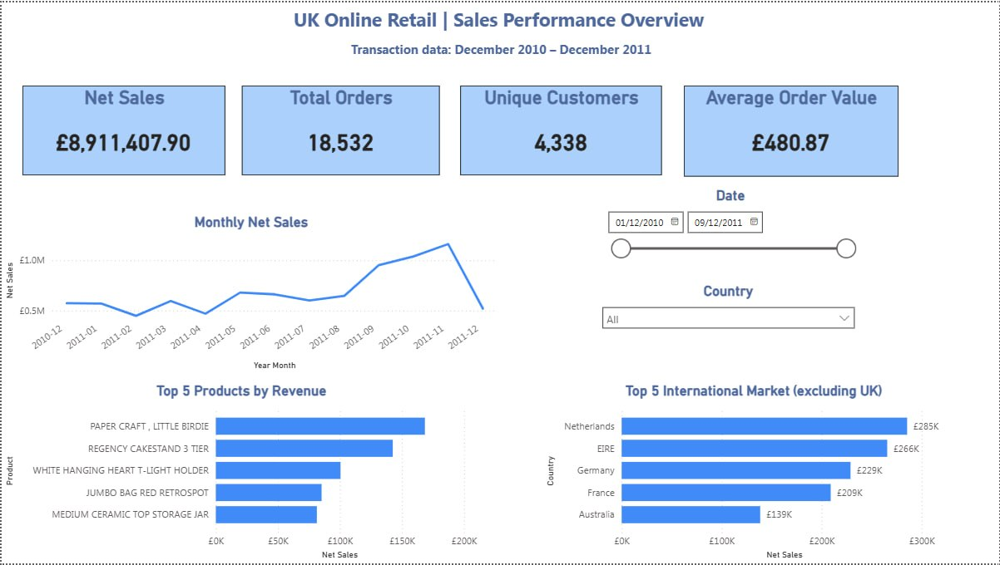
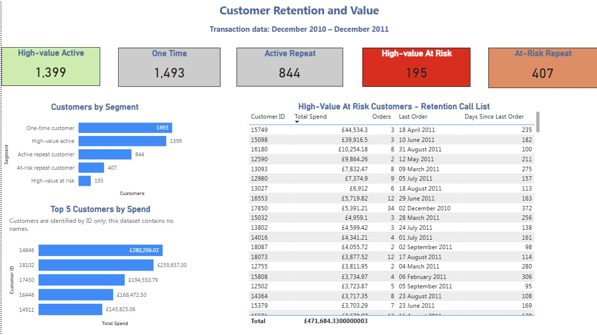
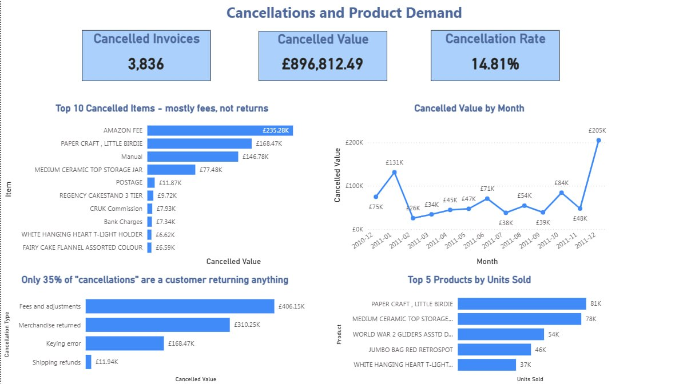

# UK Online Retail: Sales and Customer Retention Dashboard

A three-page Power BI dashboard built from **541,909 UK retail transactions**. I used PostgreSQL and SQL to clean and analyse the data, then built the dashboard in Power BI to look at sales, customers, retention, cancellations, and product demand.

One of the main findings was that **195 high-value repeat customers had not purchased for more than 90 days**, representing **£471,684.33 in historical customer value**.

> **Follow-up analysis (August 2026).** I went back to this project and rebuilt the retention logic from scratch, replacing the fixed 90-day rule with one based on each customer's own buying rhythm. That work also found a 5% overstatement in my own net sales figure. It lives in **[ANALYSIS_SUMMARY.md](ANALYSIS_SUMMARY.md)** with every number, the query behind it, and the limitations that remain.

## What I found

| Priority | Finding                               |                                  Number | Possible action                                                                     |
| -------- | ------------------------------------- | --------------------------------------: | ----------------------------------------------------------------------------------- |
| 1        | High-value customers have gone quiet  |         **195 customers / £471,684.33** | Target them with personalised re-engagement — *[revised](ANALYSIS_SUMMARY.md): 219 customers / £427,267 on a per-customer cadence rule* |
| 2        | Most "cancellations" are not returns  |    **£310,255 of £896,812.49 is a real return** | Finance to code fees separately, so the returns figure reflects actual returns      |
| 3        | Many customers only purchased once    |               **1,493 customers / 34%** | Test an incentive to encourage a second purchase rather than acquiring new customers with more marketing spend — *[revised](ANALYSIS_SUMMARY.md): the true rate is ~18% once customers are given a fair window to return* |
| 4        | Sales are strongly seasonal           | **2.6× difference** between Feb and Nov | Plan stock and staffing around the Q4 increase                                      |
| 5        | International sales are concentrated  |    **£551k from 12 customers** in NL and EIRE | Protect NL and EIRE as key accounts; grow DE and FR as markets                      |

**Every number in this README and in [ANALYSIS_SUMMARY.md](ANALYSIS_SUMMARY.md) is backed by a CSV in [`outputs/query_results/`](outputs/query_results/)**, one per query, regenerated by a single script. Nothing here is quoted from memory.

<details>
<summary><b>Contents</b></summary>

| | |
| --- | --- |
| [The five findings](#1-195-high-value-customers-have-gone-quiet) | What the analysis says and what I'd do about it |
| [Dashboard screenshots](#dashboard-screenshots) | The three report pages |
| [Methodology](#methodology) | Business problem, dataset, cleaning decisions |
| [How to Run](#how-to-run) | Reproduce everything from a fresh clone |
| [Known issues](#known-issues-found-after-the-dashboard-was-built) | Three mistakes I found in my own numbers |
| [Limitations](#limitations) | What this data cannot answer |

</details>

I ranked these based on a simple effort-versus-impact judgement rather than just choosing the biggest number.

The high-value customer list is the quickest opportunity because the customers can already be identified from the data. Cancellations matter for a different reason: the reported figure is measuring two different things at once, so the first job there is correcting the number rather than acting on it.

Reviewing this project after building it, I found several problems in my own numbers. One of them I fixed and rebuilt the report around; the rest are measured and disclosed rather than quietly restated — see [Known issues found after the dashboard was built](#known-issues-found-after-the-dashboard-was-built).

---

## 1. 195 high-value customers have gone quiet

I identified **195 customers** who:

* had placed at least two orders
* had spent at least £1,000 historically
* had not placed an order for more than 90 days

Together, these customers had generated **£471,684.33** in historical sales.

The two largest examples were:

* Customer `15749` — **£44,534.30** lifetime spend, 235 days since last order
* Customer `15098` — **£39,916.50** lifetime spend, 182 days since last order

### Why this matters

These are not one-time shoppers. They had already bought repeatedly and spent significant amounts, so losing them could matter much more than losing a customer who only made one small purchase.

### Example of the possible value

If 20% of the 195 customers (39 customers) returned and spent their historical average again (**£2,418.89 per customer**), that would be around **£94,337** in recovered sales.

    39 x £2,418.89 = £94,337

This is only an example to show the size of the opportunity. It is **not a forecast**.

### What I would do

**This changes where the retention budget goes.** Instead of spreading it across all 4,338 customers or sending one promotion to everyone, it concentrates on the **4.5% of the customer base that holds £471,684.33 of already-proven spend.**

The scale is easier to judge as a comparison. At the average first order value of £412.80, recovering these 195 customers is worth roughly **1,143 brand-new customers** — and it is a call list one account manager can work through in a fortnight, not a campaign that has to be built first.

I would work the list top-down by lifetime value, with a personalised message or offer rather than the same promotion to everyone.

### How I would measure it

Track:

* percentage of customers contacted
* percentage who make another purchase
* revenue generated within 30 days

---

## 2. Only a third of the £896,812.49 in "cancellations" is a customer returning anything

There were **3,836 cancelled invoices** worth **£896,812.49** in total. Splitting that total by what the line actually is:

| What it is | Lines | Value | Share |
| --- | ---: | ---: | ---: |
| Fees and accounting adjustments | 455 | £406,148.78 | 45.29% |
| Shipping and carriage refunds | 129 | £11,939.53 | 1.33% |
| The 80,995-unit keying error (invoice `C581484`) | 1 | £168,469.60 | 18.79% |
| **Merchandise returned by a customer** | **8,703** | **£310,254.58** | **34.60%** |

The fee and adjustment entries are recorded under stock codes that are not product codes:

| Stock code | Item | Value |
| --- | --- | ---: |
| `AMAZONFEE` | AMAZON FEE | £235,281.59 |
| `M` | Manual | £146,784.46 |
| `CRUK` | CRUK Commission | £7,933.43 |
| `BANK CHARGES` | Bank Charges | £7,340.64 |
| `D` | Discount | £5,696.22 |
| `S` | SAMPLES | £3,112.44 |

All of these use the same cancellation-style invoice structure as genuine cancelled orders, which is why they appear on a chart about customer returns.

*Query: `sql/04_sales_analysis.sql`, "What is actually inside the cancellation total?". Output: [`outputs/query_results/17_cancellation_composition.csv`](outputs/query_results/17_cancellation_composition.csv) and [`18_cancellation_non_merchandise.csv`](outputs/query_results/18_cancellation_non_merchandise.csv).*

### The December spike is a keying error, not a business event

My first reading of this data was that December 2011 was the problem, because cancelled value reached **£205,124.67** — more than double any other month. That reading was wrong, and checking it changed the recommendation.

Almost all of that month is three lines:

| Invoice | Item | Quantity | Value | Share of December |
| --- | --- | ---: | ---: | ---: |
| C581484 | PAPER CRAFT , LITTLE BIRDIE | −80,995 | £168,469.60 | 82.1% |
| C580605 | AMAZON FEE | −1 | £17,836.46 | 8.7% |
| C580604 | AMAZON FEE | −1 | £11,586.50 | 5.6% |

**96.5% of the December spike is one data-entry error plus two marketplace fees.**

The order it reversed was keyed twelve minutes earlier:

```
581483    80,995 units @ £2.08    2011-12-09 09:15
C581484  −80,995 units @ £2.08    2011-12-09 09:27
```

Someone entered an order more than six times larger than any legitimate order in the dataset and corrected it the same morning. There is no seasonal cancellation problem in December, and no saving available from "bringing it under control".

### Why this matters

If the business plans around the reported £896,812.49, it is sizing a returns problem at roughly **2.9× its actual scale**, and pointing effort at a December that does not need investigating.

The genuine merchandise returns figure is **£310,254.58**.

### What I would do

**Finance, and whoever owns the invoicing system:** code marketplace fees and manual adjustments to their own ledger line rather than to cancellation-style invoice numbers. This is a data-entry standard, not an analysis task, and it stops the returns figure measuring two unrelated things.

**Operations:** add a validation rule at order entry so a quantity far outside normal range is challenged before it is saved. The 80,995-unit entry distorted three separate charts and a third of one month's revenue before anyone noticed.

### How I would measure it

Fees appearing on a separate ledger line within one reporting cycle, and a returns figure that Finance recognises as matching their own records.

---

## 3. 34% of customers only purchased once

The customer analysis found **1,493 one-time customers**, which is around **34% of customers** in the customer-level dataset.

All five customer segments, so the 1,493 can be seen in proportion:

| Customer segment       | Customers | Total sales | Average spend |
| ---------------------- | --------: | ----------: | ------------: |
| High-value active      |     1,399 | £7,125,379.57 |     £5,093.19 |
| One-time customer      |     1,493 |   £616,311.73 |       £412.80 |
| Active repeat customer |       844 |   £491,584.69 |       £582.45 |
| High-value at risk     |       195 |   £471,684.33 |     £2,418.89 |
| At-risk repeat         |       407 |   £206,447.58 |       £507.24 |
| **Total**              | **4,338** | **£8,911,407.90** | |

*Source: [`outputs/query_results/13_customer_segment_summary.csv`](outputs/query_results/13_customer_segment_summary.csv)*

One-time customers are 34% of the customer base but only 6.9% of sales.

### Why this matters

These customers have already made a first purchase. The business has therefore already managed to convert them once, but they did not return.

That makes a second-purchase campaign worth testing.

### Example of the possible value

If 10% of the 1,493 one-time customers (149 customers) came back and spent again, that would be roughly **£86,960** in additional sales.

    149 x £582.45 average repeat-customer spend = £86,960

Measured as the *increase* over what a one-time customer already spends, rather than as new revenue, it is smaller:

    149 x (£582.45 - £412.80) = £25,329

The first figure is the sales the campaign would generate; the second is what it adds per customer over the status quo. Both are illustrations of the size of the opportunity rather than predictions.

### What I would do

Test a targeted second-purchase incentive shortly after the customer's first order.

For example, the business could test a limited-time discount or another offer designed specifically to encourage a second purchase.

### How I would measure it

Compare the percentage of first-time customers making a second purchase within 60 days before and after the campaign.

---

## 4. Sales are strongly seasonal

Monthly net sales increased from a low of **£447,137.35 in February** to a high of **£1,161,817.38 in November**.

That is around a **2.6× difference** between the low and high months.

November also increased by **11.79% compared with October**.

### Why this matters

The business appears to have a strong pre-Christmas sales period.

**December looks like a collapse and is not one.** Two things make it look worse than it was. The dataset ends on **9 December 2011**, so December is only a partial month. And £168,469.60 of the £518,192.79 recorded is the phantom order described in finding 2 — an order that was cancelled twelve minutes after it was keyed, but which still counts as revenue because the cleaning rules exclude cancellation lines rather than subtracting them.

Adjusting for both:

| | Net sales | Days | Per day |
| --- | ---: | ---: | ---: |
| November | £1,161,817.38 | 30 | **£38,727** |
| December (excluding the phantom order) | £349,723.19 | 9 | **£38,858** |

**On a per-day basis, December was running at November's rate**, within a third of a percent. Anyone reading the December bar at face value would conclude demand fell off a cliff and plan the following year around a crash that never happened.

### What I would do

The business should plan for the increase earlier in the year by considering:

* stock levels
* staffing
* marketing activity
* operational capacity

The main goal is to make sure the business can handle the higher demand during the autumn and Christmas period.

### How I would measure it

For the following year, I would look at:

* stockout incidents during September–November
* staffing levels
* November sales growth
* whether demand was met without operational problems

---

## 5. International sales are concentrated in a small number of markets

The **Netherlands, EIRE, Germany and France** account for most of the international sales in this dataset. But grouping them together hides the more important point, which is that they are two completely different situations:

| Country | Net sales | Customers | Sales per customer |
| --- | ---: | ---: | ---: |
| Netherlands | £285,446.34 | **9** | £31,716 |
| EIRE | £265,545.90 | **3** | £88,515 |
| Germany | £228,867.14 | 94 | £2,435 |
| France | £209,024.05 | 87 | £2,403 |

### Why this matters

The Netherlands and EIRE are not really markets. **£550,992 of international revenue rests on twelve customers**, and three of those account for the whole of Ireland. Losing one Irish customer would remove roughly a third of Irish revenue.

Germany and France look like genuine markets. Around 90 customers each, at an average value per customer roughly in line with a normal repeat buyer, means the demand is spread rather than resting on a handful of accounts.

Treating all four the same way would be a mistake, because concentrated revenue needs protecting and distributed revenue needs growing.

### Example of the possible value

If the Netherlands increased from 9 customers to 14 and those five new customers spent a similar amount on average, the additional sales could be around **£158,581**.

    5 x £31,716 average sales per Dutch customer = £158,581

This is only an illustration. Customer acquisition would not necessarily scale in exactly this way, and with only nine existing customers the average is not a reliable basis for forecasting.

### What I would do

**Split the four countries into two different jobs.**

The Netherlands and EIRE go to account management. Name the twelve customers, give each a named owner, and treat them the way the business would treat any concentrated account risk. The immediate goal is retention, not growth.

Germany and France take the international acquisition budget, because there is evidence there of a market that can be bought into repeatedly rather than a few relationships that happen to be large.

### How I would measure it

Track:

* number of customers by country
* sales by country
* customer acquisition cost
* sales generated from new customers

---

# Dashboard Screenshots

Rebuilt in August 2026. **Every figure on these three pages reconciles with the CSVs in [`outputs/query_results/`](outputs/query_results/)** and with the numbers quoted above — there is no longer any gap between what the dashboard shows and what this write-up says.

One number on them is knowingly wrong and left that way on purpose: **Net Sales of £8,911,407.90 counts fully cancelled orders as revenue.** That is the unfixed defect in [Known issues](#known-issues-found-after-the-dashboard-was-built) — measured, bracketed, and deliberately not restated, because it is the denominator of nearly every figure in this project.

The report file itself is in the repository at [`powerbi/online_retail_dashboard.pbix`](powerbi/online_retail_dashboard.pbix).

### 1. Sales Performance Overview

Net sales, orders, customers and average order value; the monthly trend; and the top products and international markets.



### 2. Customer Retention and Value

All five customer segments — they sum to 4,338, the same total as Unique Customers on page 1 — the highest-spending customers, and the 195-name retention call list that Finding 1 is built on.



### 3. Cancellations and Product Demand

The cancellation rate, the monthly trend with its December spike, and the composition chart that carries Finding 2: of £896,812.49 in "cancellations", only £310,254.58 is a customer returning merchandise.



---

# Tech Stack

| Tool                | What I used it for                                          |
| ------------------- | ----------------------------------------------------------- |
| **PostgreSQL**      | Storing the raw transaction data and creating cleaned views |
| **SQL**             | Data cleaning, quality checks and analysis                  |
| **Python (pandas)** | Converting the original Excel file to CSV, and exporting every query result to CSV |
| **Power BI**        | Building the three-page dashboard                           |
| **DAX**             | Creating the measures used by the dashboard                 |

---

# Methodology

## Business problem

I built this project as if I were analysing data for a **UK online gift retailer**.

The aim was to answer practical questions about sales and customers rather than just build a dashboard for the sake of visualisation.

The main questions were:

* How are sales and orders changing over time?
* Which products and countries generate the most sales?
* Which customers are the most valuable?
* Which valuable customers have stopped purchasing?
* How large are cancellations and how do they change over time?

The dataset contains sales information but **does not contain costs**, so this project focuses on sales, revenue, customers, orders and cancellations rather than profit or margin.

---

## Dataset

I used the **UCI Online Retail dataset**.

It contains transaction-level data from a UK-based online retailer covering **1 December 2010 to 9 December 2011**.

The original dataset contains **541,909 rows**.

Each row represents a product line on an invoice and includes fields such as:

* Invoice number
* Stock code
* Product description
* Quantity
* Invoice date
* Unit price
* Customer ID
* Country

### Source

Chen, D. (2015). *Online Retail* [Dataset]. UCI Machine Learning Repository.

[https://doi.org/10.24432/C5BW33](https://doi.org/10.24432/C5BW33)

Licensed under **CC BY 4.0**.

---

# Data Preparation

I kept the original table unchanged and used SQL views for the cleaning steps. This makes it easier to see what was changed and allows the raw data to be preserved.

The main checks and cleaning steps were:

### Cancelled invoices

I excluded invoices beginning with `C` from the sales analysis.

There were **3,836 cancellation invoices**, with a total value of **£896,812.49**.

I kept them separately so cancellations could be analysed rather than simply removing them and hiding the issue.

### Non-positive quantities and prices

I removed rows with:

* non-positive quantities: **10,624**
* non-positive prices: **2,521**

These rows mainly represented things such as adjustments, write-offs and free samples rather than normal sales.

### Missing customer IDs

There were **135,080 rows without a Customer ID**, which is almost 25% of the original data.

Because these transactions cannot be linked to a specific customer, I excluded them from customer-level analysis.

This means the customer figures in this project represent the transactions that **can be linked to a customer**, rather than the entire dataset.

### Sales value

Sales value was calculated as:

```sql
quantity * unit_price
```

### At-risk customers

I defined an at-risk customer as someone who:

* had placed at least 2 orders
* had spent at least £1,000
* had not ordered for more than 90 days

The 90-day period was measured from the **last transaction date in the dataset**, rather than from today's date.

This is important because the dataset is from 2010–2011. Comparing it with today's date would incorrectly make every customer look inactive.

**The 2026 follow-up replaced this rule.** A fixed 90-day window treats a customer who buys weekly and one who buys quarterly as the same, which is wrong in both directions. The revised rule flags a customer who has been silent for more than **2× their own median gap between purchases** (minimum 30 days), scoring only customers with three or more purchase occasions and reporting the rest separately.

The multiple was chosen from the data rather than assumed: across 11,551 historical gaps, only **11.6%** ever exceeded 2× the customer's own median, so crossing that line is genuinely unusual behaviour. 2× was preferred over the rarer 3× because the costs are asymmetric — a false positive is one wasted phone call, a false negative is a proven repeat spender lost.

The clearest illustration is customer `16029`: the 11th largest customer in the business, who buys every 7.5 days and had been silent for 38 days — five times their own rhythm. The 90-day rule classified them as **"High-value active"** and put them on no list at all.

Full method, before/after comparison and limitations: [ANALYSIS_SUMMARY.md](ANALYSIS_SUMMARY.md).

More detail on the data quality checks is available in [DATA_QUALITY_FINDINGS.md](DATA_QUALITY_FINDINGS.md).

---

# Project Structure

```text
UK-Online-Retail-Sales-and-Customer-Retention-Dashboard/
├── data/
│   ├── README.md                       (where to download the dataset)
│   └── raw Excel file + converted CSV  (not tracked in git)
├── src/
│   ├── 01_excel_to_csv.py              (Excel → CSV conversion)
│   └── 02_export_query_results.py      (runs every query in sql/, writes the CSVs)
├── sql/
│   └── 01–11, run in order             (cleaning, checks, analysis)
├── outputs/
│   ├── figures/
│   │   └── dashboard screenshots
│   └── query_results/
│       └── 64 CSVs, one per analysis query
├── powerbi/
│   ├── online_retail_dashboard.pbix    (the built report)
│   └── dax_measures.txt                (the 12 DAX measures, with reasoning)
├── ANALYSIS_SUMMARY.md                 (2026 follow-up: every number + limitations)
├── DATA_QUALITY_FINDINGS.md            (what the raw data looks like, and its problems)
├── POWERBI_BUILD_GUIDE.md              (how to rebuild the report by hand)
├── requirements.txt
├── LICENSE                             (MIT)
├── .gitignore
└── README.md
```

The `sql/` folder runs in order. Scripts `01`–`05` build the original dashboard.
Scripts `06`–`11` are the 2026 retention follow-up and are additive — they create
new views rather than modifying the originals, so every published figure still
reproduces:

| Script | What it answers |
| ------ | --------------- |
| `01_create_table.sql` | Loads the raw CSV into an untouched landing table |
| `02_data_quality_checks.sql` | Is this data trustworthy, and what must be excluded? |
| `03_clean_views.sql` | What counts as a real sale, and how big are cancellations? |
| `04_sales_analysis.sql` | Sales over time, by product, by country; what cancellations consist of |
| `05_customer_analysis.sql` | Who is valuable, and who has gone quiet (90-day rule) |

The 2026 follow-up:

| Script | What it answers |
| ------ | --------------- |
| `06_retention_cadence.sql` | At-risk customers judged against their own buying rhythm |
| `07_revenue_concentration.sql` | Revenue concentration, top-customer exposure, and the reversal fix |
| `08_first_to_second_purchase.sql` | One-and-done rate and how long the second purchase takes |
| `09_cohort_retention.sql` | Retention by first-purchase month |
| `10_customer_value.sql` | Observed customer value, one-time versus repeat |
| `11_stayers_vs_leavers.sql` | What distinguishes retained from lapsed customers (correlation only) |

There is no `notebooks/` folder because I did not use a Jupyter notebook for the analysis.

The main analysis is in the `sql/` folder. `powerbi/` contains the built report and the DAX measures behind it. Every query in `sql/` writes a CSV to `outputs/query_results/` via `src/02_export_query_results.py`.

Re-running a script drops and recreates its views with `CASCADE`, which also drops anything built on top of them. That is intentional — a stale dependent view is worse than a missing one — but it means the scripts should be run forward in order rather than individually out of sequence.

---

# How to Run

## 1. Download the dataset

Download `Online Retail.xlsx` from the [UCI repository](https://archive.ics.uci.edu/dataset/352/online+retail) and place it in the `data/` folder.

See `data/README.md` for the expected file location.

## 2. Convert Excel to CSV

```bash
pip install -r requirements.txt
python src/01_excel_to_csv.py
```

## 3. Create the PostgreSQL database

```bash
createdb online_retail_db
psql -d online_retail_db -f sql/01_create_table.sql
```

## 4. Run the SQL scripts

Run them in order. Scripts `02`–`05` build the original dashboard; `06`–`11` are the 2026 retention follow-up and depend on the views the earlier ones create, so the order matters.

```bash
for f in sql/0[2-9]_*.sql sql/1[01]_*.sql; do psql -d online_retail_db -v ON_ERROR_STOP=1 -f "$f"; done
```

Or one at a time:

```bash
psql -d online_retail_db -f sql/02_data_quality_checks.sql
psql -d online_retail_db -f sql/03_clean_views.sql
psql -d online_retail_db -f sql/04_sales_analysis.sql
psql -d online_retail_db -f sql/05_customer_analysis.sql
psql -d online_retail_db -f sql/06_retention_cadence.sql
psql -d online_retail_db -f sql/07_revenue_concentration.sql
psql -d online_retail_db -f sql/08_first_to_second_purchase.sql
psql -d online_retail_db -f sql/09_cohort_retention.sql
psql -d online_retail_db -f sql/10_customer_value.sql
psql -d online_retail_db -f sql/11_stayers_vs_leavers.sql
```

The data quality results are documented in `DATA_QUALITY_FINDINGS.md`.

## 5. Export the query results

```bash
python src/02_export_query_results.py
```

This writes 64 CSVs to `outputs/query_results/` — one per analysis query. It does not contain the queries itself; it reads them out of the `sql/` files, so the CSVs cannot drift from the SQL they claim to come from. Every number quoted in this README and in [ANALYSIS_SUMMARY.md](ANALYSIS_SUMMARY.md) can be checked against one of these files.

## 6. Open the Power BI report

The built report is in the repository:

```text
powerbi/online_retail_dashboard.pbix
```

Open it in Power BI Desktop. The data is imported rather than live, so **every visual renders from data cached inside the file** — you can open and read the whole report without PostgreSQL running at all. It only asks for credentials if you hit Refresh, and the server address stored in it is whichever machine it was built against, so change it under **Transform data → Data source settings** if you want to refresh it yourself.

Power BI Desktop is Windows-only; there is no Mac build.

To rebuild it from scratch instead, follow `POWERBI_BUILD_GUIDE.md`.

The guide covers:

* connecting Power BI to PostgreSQL
* creating the date table
* creating the DAX measures
* building each report page

The DAX measures are also listed separately in:

```text
powerbi/dax_measures.txt
```

---

# Known issues found after the dashboard was built

Reviewing this project after building it, I found three problems in my own numbers, and a fourth when I rebuilt the report in August 2026. The cancellation rate is fixed and the report was rebuilt around the fix. The two sales-total problems are measured and disclosed but deliberately not applied — the reasoning is at the end of this section.

### The cancellation rate of 17.15% was overstated — now fixed

The dashboard originally calculated it as cancelled invoices ÷ (cancelled invoices + valid orders), which is **3,836 ÷ (3,836 + 18,532)**.

Those two numbers came from different places. The 3,836 cancellations were counted from the raw table, but the 18,532 orders were counted from the cleaned view, after rows with no customer ID and other invalid rows had been removed. The denominator was therefore drawn from a smaller population than the numerator, which pushed the rate up.

There was a second fault I only found when rebuilding the report. `vw_valid_sales` is related to the report's date table and `vw_cancellations` is not, so any date filter shrank the denominator and left the numerator whole. Filtered to February 2011 the card returned **79.37%** against a real rate of **15.72%** — not a slightly inflated number, a meaningless one.

**Both are fixed.** `vw_all_invoices` in [sql/03_clean_views.sql](sql/03_clean_views.sql) is one row per invoice for the whole dataset, cancelled or not, each carrying a date. Both halves of the fraction now count from it, so the rate is consistent *and* filters correctly by month. The dashboard reports **14.81%**.

| | Old | Fixed |
| --- | ---: | ---: |
| Full period | 17.15% | **14.81%** |
| Filtered to February 2011 | 79.37% | **15.72%** |

*Source: [`59_cancellation_rate_corrected.csv`](outputs/query_results/59_cancellation_rate_corrected.csv), [`60_cancellation_rate_by_month.csv`](outputs/query_results/60_cancellation_rate_by_month.csv)*

### "Net Sales" is not net of returns

`Net Sales` is `SUM(quantity × unit_price)` over `vw_valid_sales`. That view **excludes** cancellation lines, but excluding them is not the same as subtracting them.

A cancellation is recorded as a separate invoice beginning with `C`. The original positive sale line stays in the data under its own invoice number and passes every cleaning filter. So an order that was placed and then cancelled is still counted as revenue, and the cancellation that reversed it is simply not counted at all.

The clearest example is order `581483`: 80,995 units, **£168,469.60**, cancelled twelve minutes later, and still sitting in the sales total today.

Properly netting off the cancellations that can be attributed to a customer would reduce the figure by about **£611,342**, from £8,911,407.90 to roughly **£8,300,066**. A strictly accurate name for the measure as built would be *gross sales, excluding cancellation lines, identified customers only*.

**Measured more precisely in the 2026 follow-up.** The £611,342 above is the total value of every cancellation carrying a customer ID, which is an upper bound. Matching each cancellation to the specific sale line it reverses — same customer, product, unit price and exact quantity, cancellation dated on or after the sale — identifies **£445,874.74 across 3,887 sale lines and 792 customers**, exactly **5.00%** of reported net sales. The remaining 6,088 cancellation lines (**£207,858.81**) have no exact match, mostly partial cancellations and price-adjusted returns.

So the overstatement is **between £445,875 and £611,342**, and true net sales for identified customers is **between £8,300,066 and £8,465,533**. The corrected view `vw_valid_sales_net` in [sql/07_revenue_concentration.sql](sql/07_revenue_concentration.sql) takes the conservative end, removing only sale lines with a demonstrable match. The original `vw_valid_sales` is unchanged, so every published figure above still reproduces.

### The sales figures exclude rows they did not need to

`vw_valid_sales` requires a customer ID. That is correct for the customer and retention pages, because you cannot group by an ID that is not there — but it is wrong for the sales pages, where those rows still carry a valid date, product, quantity and price.

The 135,080 rows without a customer ID are worth **£1,755,277**. Including them, total sales are **£10,666,684.54** rather than £8,911,407.90.

The two errors above work in opposite directions and partly cancel out, which is worse than either on its own — it means the headline total looks plausible while resting on two separate mistakes.

**What I fixed and what I did not.** The cancellation rate is fixed, because it is a self-contained metric — correcting it changed one card and this one section.

The two sales-total problems are documented but not applied. `Net Sales` is the denominator of nearly every figure in this README and in [ANALYSIS_SUMMARY.md](ANALYSIS_SUMMARY.md); restating it would mean rewriting the entire analysis rather than disclosing a bounded error I have already measured to the pound. ANALYSIS_SUMMARY carries both the published and corrected bases side by side for exactly this reason, and the corrected view `vw_valid_sales_net` exists in the repo for anyone who wants to run the numbers the other way.

The rule I applied: **cheap and local, fix it; expensive and cascading, measure it, bracket it, and say so.**

---

# Limitations

There are several important limitations to this project.

### No profit data

The dataset contains sales and unit prices but no costs, so I cannot calculate profit or margin.

### Limited customer information

There are no customer names, demographics or marketing channels. Customers are identified only by `CustomerID`.

### The at-risk definition is rule-based

The at-risk customer list uses a fixed rule:

> 2+ orders + £1,000+ historical spend + 90+ days since last order

This is useful for identifying a group to investigate, but it is **not a predictive churn model**.

One limitation of this rule is that a customer who made only one very large purchase can still be classified as a one-time customer.

### Missing Customer IDs

Around a quarter of the original rows do not contain a Customer ID.

This means customer-level results only describe the transactions that can be attributed to a known customer. That restriction is unavoidable for the customer and retention analysis, but it should not have been applied to the sales totals as well — see [Known issues found after the dashboard was built](#known-issues-found-after-the-dashboard-was-built).

### Old dataset

The data covers **2010–2011**, so the seasonal patterns and country mix may not represent today's retail market.

---

# Future Work

There are three main improvements I would make next.

### 1. Improve the cancellation analysis

Separate genuine customer cancellations from fee adjustments and other accounting entries at the source.

### 2. Build a churn model

*Partly addressed in the 2026 follow-up, though deliberately not with a model — see [ANALYSIS_SUMMARY.md](ANALYSIS_SUMMARY.md). With one year of data there is no post-period in which to observe who actually churned, so there is nothing to train or validate against. The revised rule identifies customers behaving unlike themselves; it does not predict churn and is not described as doing so.*

Replace the simple 90-day rule with a model that estimates the probability of a customer returning or becoming inactive.

### 3. Add cost data

If cost or margin data were available, the dashboard could move from measuring revenue to analysing **profitability and customer value**.

---

# What I Learned

This project helped me practise working through a data project from the raw dataset to a finished dashboard.

The main things I worked on were:

* cleaning a large transaction dataset using SQL
* writing CTEs and window functions
* checking data quality before analysing it
* building customer-level metrics
* connecting PostgreSQL to Power BI
* creating DAX measures
* turning analysis into business recommendations
* being careful about what the data can and cannot actually tell us

One of the biggest lessons was that **getting the numbers right comes before building the dashboard**. For example, finding that "AMAZON FEE" was included in the cancellation data changed how I interpreted the cancellation results.

---

# Licence

The code and documentation in this repository are MIT licensed — see [LICENSE](LICENSE).

The dataset is not mine and is not covered by that licence. It is the UCI Online Retail dataset, licensed **CC BY 4.0**, and is not redistributed here — `data/` is gitignored and the download step is in [How to Run](#how-to-run).

---

# Contact

**La Yaung Linn Lett**

[GitHub](https://github.com/layaung-linnlett) · [LinkedIn](https://www.linkedin.com/in/layaung-linnlett/) · [layaunglinnlett1@gmail.com](mailto:layaunglinnlett1@gmail.com)
